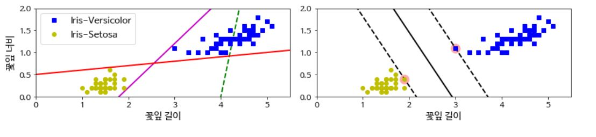
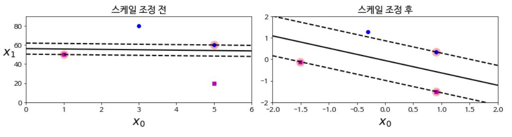
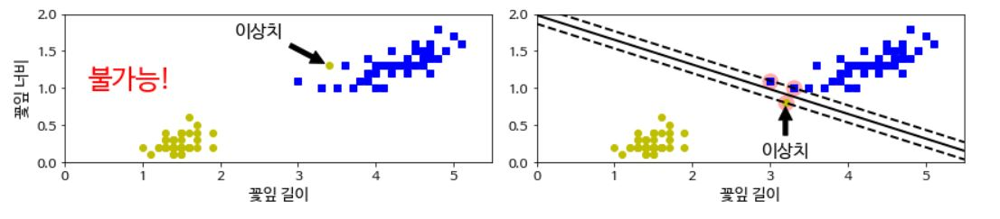
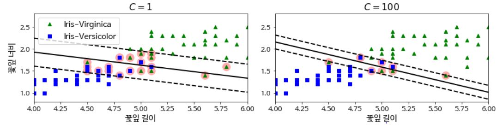
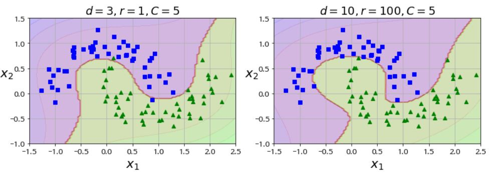
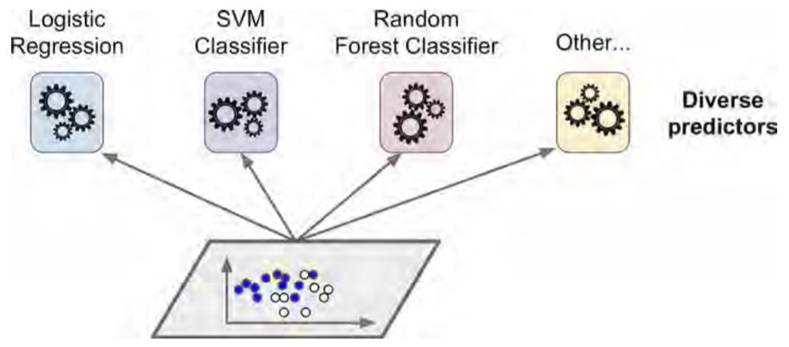

# Support Vector Machine
- 선형, 비선형, 회귀, 이상치 탐색 문제에 사용할 수 있다
- 복잡한 분류 문제, 작거나 중간 크기의 데이터셋에 적합

## Large Margin Classification
SVM의 Decision Boundary는 클래스를 나누면서 제일 가까운 훈련 샘플로부터 가능한 멀리 떨어져 있다.

## 특성의 스케일에 민감함

## Soft Margin Classification
- Hard Margin Classification
  - **모든** 샘플이 올바르게 분류.
  - 데이터가 선형적으로 구분될 수 있어야 함
  - 이상치에 민감
- Soft Margin Classification
  - 도로의 폭을 넓게 유지하면서
  - Margin 오류 사이의 적절한 균형
 '

## 라지 마진 VS 마진 오류   
- 하이퍼파라미터 C값이 작으면 폭이 커지며 마진 오류도 커진다

## 비선형 분류  

# 엑스트라 트리
- Random Forest에서 각 노드는 무작위로 서브셋을 만들어 사용
- 보통의 Decision Tree는 최적의 임계값을 찾는다
- Extra Tree는 무작위로 분할한 다음 최상의 분할을 선택

# 앙상블 학습
## 투표 기반 분류기

### 직접 투표(Hard Voting)
- 각 분류기의 예측을 모아서 가장 많이 선택된 클래스를 예측
### 간접 투표(Soft Voting)
- 모든 분류기가 클래스의 확률을 예측할 수 있을 때
- 개별 분류기의 예측을 평균내어 확률이 가장 높은 클래스를 예측
- 확률이 높은 투표에 비중을 둬서 hard voting 보다 성능이 높다.
